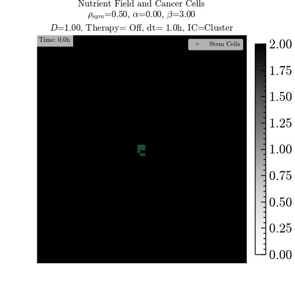

# TumorNet: A Cellular Automaton Tumor Growth Simulator

**TumorNet** is a modular Python simulator for modeling tumor growth using a **cellular automaton** framework coupled with a **nutrient diffusion field** solved via the **Runge–Kutta (RK4)** integration method.
It supports **chemotaxis**, **stem/non-stem cell dynamics**, and **therapy pulses**, with rich visualization and data export capabilities.

---

## Overview

TumorNet models a 2D lattice populated by stem and non-stem cancer cells. Each cell:

* Divides according to probabilistic rules,
* Consumes nutrients from a diffusive field,
* Migrates toward nutrient-rich regions (chemotaxis),
* Responds to therapy pulses that can kill or suppress proliferation.

The simulation produces:

* Animated **GIFs** of spatial tumor dynamics,
* **Time-series plots** (PNG) of cell population growth and nutrient levels,
* **CSV** files of all recorded simulation data.

---

## ⚙️ Features

* **Object-Oriented Design** (easily extensible and importable as a Python module)
* **Runge–Kutta (RK4)** integration for nutrient diffusion
* **Configurable lattice topology** (`moore` or `von_neumann` neighborhoods)
* **Flexible boundary conditions** (`reflective`, `periodic`, or `dirichlet`)
* **Stem and non-stem cell differentiation** with independent division rules
* **Chemotaxis** (nutrient-driven migration)
* **Therapy module** with configurable pulses:

  * Killing probabilities for both cell types
  * Reduced proliferation capacity
  * Adjustable therapy start, duration, and periodicity
* **Export options**:

  * Animated GIF of tumor evolution
  * Time-series plots (PNG)
  * Quantitative results (CSV)
    
* **Dual execution**:

  * From command line
  * From Jupyter notebooks via class instantiation

---

## 🧩 Installation

### Requirements

TumorNet requires Python ≥3.9 and the following libraries:

```bash
numpy
matplotlib
imageio
pillow
pandas
scienceplots
```

### Install **tumorNet**

Clone the repository:

```bash
git clone https://github.com/alanPalma25/tumorNet.git
cd TumorNet
```
Use pip for installing:

```bash
pip install -e .
```

---

## Usage

You can run **TumorNet** either:

### 1️⃣ From the Command Line

```bash
python -m tumorNet.tumorNet --config config.ini
```

or override parameters inline:

```bash
python -m tumorNet.tumorNet --nx 100 --ny 100 --steps 300 --save_gif True
```

Please execute the following comand to see the available options:

```bash
python -m tumorNet.tumorNet --help
```

---
## Configuration File (`config.ini`)

TumorNet supports a hierarchical `.ini` configuration file for full reproducibility. You can either copy the `config.init`, or create your own file running the script `config_generator.py`:

```bash
python config_generator.py
```

Example:

```ini
[SIMULATION]
nx = 80
ny = 80
dt = 1.0
steps = 240
ps = 0.5
alpha = 0.0
prolif_capacity = 5
mean_cycle = 24.0
sd_cycle = 2.0
diff_constant = 1.0
decay = 0.0
initial_nutrient = 1.0
uptake_nonstem = 0.02
uptake_stem = 0.01
diffusion_substeps = 5
chemotaxis_beta = 3.0
neighborhood = moore
boundary = reflective

[THERAPY]
therapy_on = True
therapy_start = 50.0
therapy_duration = 20.0
therapy_period = 100.0
therapy_kill_prob_nonstem = 0.5
therapy_kill_prob_stem = 0.1
therapy_reduce_prolif = 1
therapy_apply_each_step = True

[INIT_SEED]
init_seed = cluster
seed_count = 1

[OUTPUT]
save_gif = True
save_time_series_png = True
save_time_series_csv = True
output_dir = output
output_gif = tumor_dynamics.gif
output_time_series_png = time_series.png
output_time_series_csv = counts.csv
frames_capture_every = 1
fps = 10
```
---

## Class Structure

| Class                | Description                                                                                       |
| -------------------- | ------------------------------------------------------------------------------------------------- |
| **`Cell`**           | Represents an individual cell with attributes for type, proliferation, and division cycle.        |
| **`Lattice`**        | 2D grid storing cell objects and defining neighborhood logic.                                     |
| **`NutrientField`**  | Handles the diffusion field using RK4 integration and uptake coupling.                            |
| **`TumorSimulator`** | Main controller integrating all submodules and handling simulation logic, visualization, and I/O. |

---

## Example Plot

Movie simulation:




The time-series PNG shows population evolution:

* **Blue**: Total cells
* **Green**: Stem cells
* **Orange**: Non-stem cells
* **Red dashed**: Average nutrient concentration


---

## Repository Structure

```
tumorNet/
│
├── tumorNet/                  
│   ├── tumorNet.py            # Main simulator
│   └── __init__.py.csv
├── setup.py                   # Install tumorNet
├── config_generator.py        # Script to generate the config file        
├── config.ini                 # Example configuration file
├── output_example/            # Simulation outputs
│   ├── tumor_dynamics_example.gif
│   ├── time_series_example.png
│   └── counts_example.csv
├── README.md                  # Project documentation
└── LICENSE      
```

---

## Authors

**Alan I. Palma** — Physics Student, Yachay Tech University

**Sofía Feijóo** — Biomedical Engineering student, Yachay Tech University


